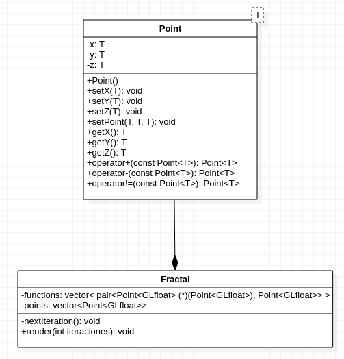

# Flame fractal implementation with OPENGL
## IFS
   Es una forma de "sencilla" de renderizar un fractal con funciones lineales.
## Flame Fractal
   Se usa un transformación sobre las funciones lineales para generar otros tipos de fractalesn
## Diagrama UML

## Implementación

   La forma más sencilla de realizar este tipo de fractales es sobrecargando operadores y utilizar un vector de funciones del tipo de la estructura o clases a utilizar. Estas funciones tinen un dominio de [-1,1] y su rango es de [-1,1] esto es para garantizar que todos los puntos esten dentro de la ventana de OpenGL que en dos dimensiones tiene un mapa
   cartesiano de [-1,1]x[-1,1]. Por las limitaciones del computador no se almacena los datos en una estructura y la forma como se guarda la imagen es mediante captura de pantalla.

## Alimentación de la interfaz		 
   Si quieres agregar más funciones o caracteristicas solo tienes que crear funciones lineales del tipo Point<GLfloat> que reciba como parámeto un objeto Point<GLfloat>, de preferencia varias o más de 50. Tambien tienes que crear pocas funciones no lineales con las caracteristicas anteriores, estas tienen que cumplir la propiedad de clausura es decir no deben salir de un rango fijo. En el main hay algunos ejempos de funciones para que tengan como guía.
   
## Bibliografía
- [Flame Fractal paper](http://flam3.com/flame_draves.pdf)